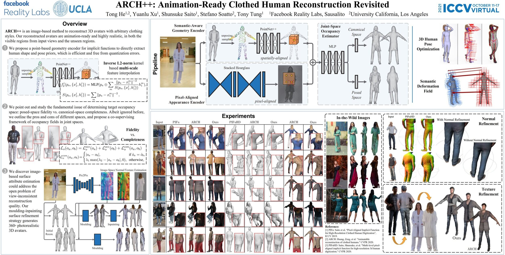
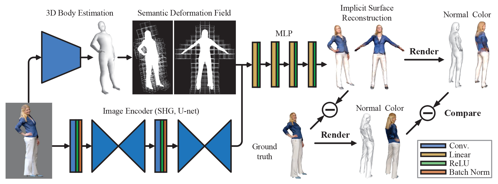
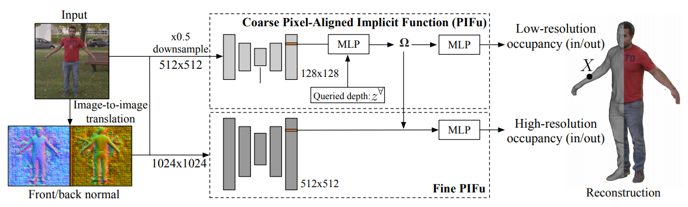
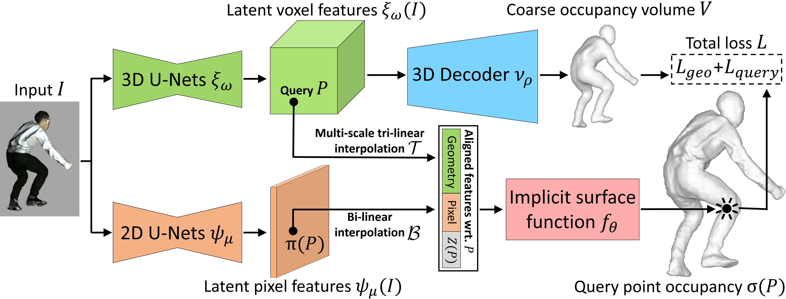
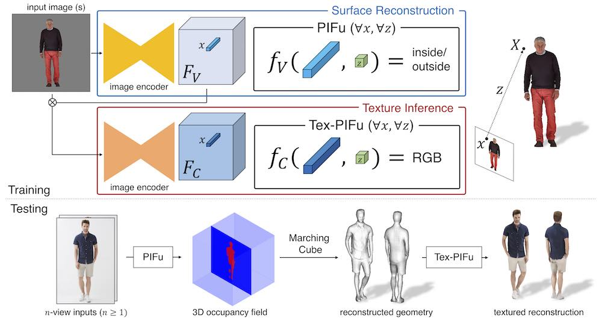
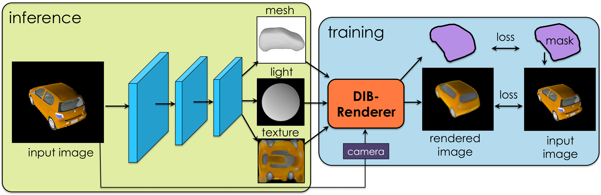
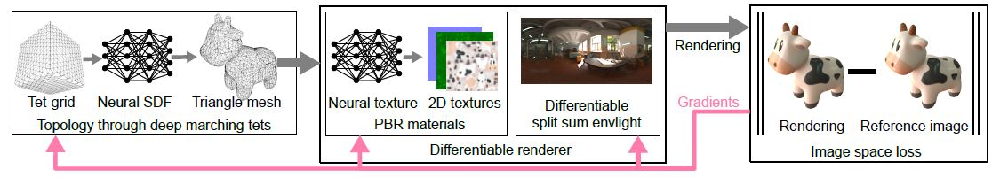

# 
Awesome-3D-CV-CG

Awesome 3D Computer Vision and Computer Graphics.

  

## 3D Object Reconstruction from Images and Videos

BANMo: Building Animatable 3D Neural Models from Many Casual Videos

    

Prior work for articulated 3D shape reconstruction often relies on specialized sensors (e.g., synchronized multicamera systems), or pre-built 3D deformable models (e.g., SMAL or SMPL). Such methods are not able to scale to diverse sets of objects in the wild. We present BANMo, a method that requires neither a specialized sensor nor a pre-defined template shape. BANMo builds high-fidelity, articulated 3D “models” (including shape and animatable skinning weights) from many monocular casual videos in a differentiable rendering framework. While the use of many videos provides more coverage of camera views and object articulations, they introduce significant challenges in establishing correspondence across scenes with different backgrounds, illumination conditions, etc. Our key insight is to merge three schools of thought; (1) classic deformable shape models that make use of articulated bones and blend skinning, (2) volumetric neural radiance fields (NeRFs) that are amenable to gradient-based optimization, and (3) canonical embeddings that generate correspondences between pixels and an articulated model. We introduce neural blend skinning models that allow for differentiable and invertible articulated deformations. When combined with canonical embeddings, such models allow us to establish dense correspondences across videos that can be self-supervised with cycle consistency. On real and synthetic datasets, BANMo shows higher-fidelity 3D reconstructions than prior works for humans and animals, with the ability to render realistic images from novel viewpoints and poses. 
  
code: https://github.com/facebookresearch/banmo  
paper: https://arxiv.org/pdf/2112.12761.pdf   
project: https://banmo-www.github.io/

PHORHUM: Photorealistic Monocular 3D Reconstruction of Humans Wearing Clothing

    

We present PHORHUM, a novel, end-to-end trainable, deep neural network methodology for photorealistic 3D human reconstruction given just a monocular RGB image. Our pixel-aligned method estimates detailed 3D geometry and, for the first time, the unshaded surface color together with the scene illumination. Observing that 3D supervision alone is not sufficient for high fidelity color reconstruction, we introduce patch-based rendering losses that enable reliable color reconstruction on visible parts of the human, and detailed and plausible color estimation for the non-visible parts. Moreover, our method specifically addresses methodological and practical limitations of prior work in terms of representing geometry, albedo, and illumination effects, in
an end-to-end model where factors can be effectively disentangled. In extensive experiments, we demonstrate the versatility and robustness of our approach. Our state-ofthe-art results validate the method qualitatively and for different metrics, for both geometric and color reconstruction. 

code:  
paper: https://arxiv.org/pdf/2204.08906.pdf  
project: https://phorhum.github.io/  

GANverse3D: Image GANs meet Differentiable Rendering for Inverse Graphics and Interpretable 3D Neural Rendering

  

Differentiable rendering has paved the way to training neural networks to perform “inverse graphics” tasks such as predicting 3D geometry from monocular photographs. To train high performing models, most of the current approaches rely on multi-view imagery which are not readily available in practice. Recent Generative Adversarial Networks (GANs) that synthesize images, in contrast, seem to acquire 3D knowledge implicitly during training: object viewpoints can be manipulated by simply manipulating the latent codes. However, these latent codes often lack further physical interpretation and thus GANs cannot easily be inverted to perform explicit 3D reasoning. In this paper, we aim to extract and disentangle 3D knowledge learned by generative models by utilizing differentiable renderers. Key to our approach is to exploit GANs as a multi-view data generator to train an inverse graphics network using an off-the-shelf differentiable renderer, and the trained inverse graphics network as a teacher to disentangle the GAN’s latent code into interpretable 3D properties. The entire architecture is trained iteratively using cycle consistency losses. We show that our approach significantly outperforms state-of-the-art inverse graphics networks trained on existing datasets,both quantitatively and via user studies. We further showcase the disentangled GAN as a controllable 3D “neural renderer”, complementing traditional graphics renderers.  

code:  
paper: https://arxiv.org/pdf/2010.09125.pdf  
project: https://nv-tlabs.github.io/GANverse3D/ 

ARCH++: Animation-Ready Clothed Human Reconstruction Revisited

We present ARCH++, an image-based method to reconstruct 3D avatars with arbitrary clothing styles. Our reconstructed avatars are animation-ready and highly realistic, in both the visible regions from input views and the unseen regions. While prior work shows great promise of reconstructing animatable clothed humans with various topologies, we observe that there exist fundamental limitations resulting in sub-optimal reconstruction quality. In this paper, we revisit the major steps of image-based avatar reconstruction and address the limitations with ARCH++. First, we introduce an end-to-end point based geometry encoder to better describe the semantics of the underlying 3D human body, in replacement of previous hand-crafted features. Second, in order to address the occupancy ambiguity caused by topological changes of clothed humans in the canonical pose, we propose a co-supervising framework with cross-space consistency to jointly estimate the occupancy in both the posed and canonical spaces. Last, we use image-to-image translation networks to further refine detailed geometry and texture on the reconstructed surface, which improves the fidelity and consistency across arbitrary viewpoints. In the experiments, we demonstrate improvements over the state of the art on both public benchmarks and user studies in reconstruction quality and realism.  

code:   
paper: https://arxiv.org/pdf/2108.07845.pdf   
project: https://tonghehehe.com/archpp

ARCH: Animatable Reconstruction of Clothed Humans

In this paper, we propose ARCH (Animatable Reconstruction of Clothed Humans), a novel end-to-end framework for accurate reconstruction of animation-ready 3D clothed humans from a monocular image. Existing approaches to digitize 3D humans struggle to handle pose variations and recover details. Also, they do not produce models that are animation ready. In contrast, ARCH is a learned pose-aware model that produces detailed 3D rigged full-body human avatars from a single unconstrained RGB image. A Semantic Space and a Semantic Deformation Field are created using a parametric 3D body estimator. They allow the transformation of 2D/3D clothed humans into a canonical space, reducing ambiguities in geometry caused by pose variations and occlusions in training data. Detailed surface geometry and appearance are learned using an implicit function representation with spatial local features. Furthermore, we propose additional per-pixel supervision on the 3D reconstruction using opacity-aware differentiable rendering. Our experiments indicate that ARCH increases the fidelity of the reconstructed humans. We obtain more than 50% lower reconstruction errors for standard metrics compared to state-of-the-art methods on public datasets. We also show numerous qualitative examples of animated, high-quality reconstructed avatars unseen in the literature so far.   

code:   
paper: https://arxiv.org/pdf/2004.04572.pdf  
project: https://vgl.ict.usc.edu/Research/ARCH/  

PIFuHD: Multi-Level Pixel-Aligned Implicit Function for High-Resolution 3D Human Digitization

Recent advances in image-based 3D human shape estimation have been driven by the significant improvement in representation power afforded by deep neural networks. Although current approaches have demonstrated the potential in real world settings, they still fail to produce reconstructions with the level of detail often present in the input images. We argue that this limitation stems primarily form two conflicting requirements; accurate predictions require large context, but precise predictions require high resolution. Due to memory limitations in current hardware, previous approaches tend to take low resolution images as input to cover large spatial context, and produce less precise (or low resolution) 3D estimates as a result. We address this limitation by formulating a multi-level architecture that is end-to-end trainable. A coarse level observes the whole image at lower resolution and focuses on holistic reasoning. This provides context to an fine level which estimates highly detailed geometry by observing higher-resolution images. We demonstrate that our approach significantly outperforms existing state-of-the-art techniques on single image human shape reconstruction by fully leveraging 1k-resolution input images.  

code: https://github.com/facebookresearch/pifuhd  
paper: https://arxiv.org/pdf/2004.00452.pdf   
project: https://shunsukesaito.github.io/PIFuHD/

Geo-PIFu: Geometry and Pixel Aligned Implicit Functions for Single-view Human Reconstruction

We propose Geo-PIFu, a method to recover a 3D mesh from a monocular color image of a clothed person. Our method is based on a deep implicit function-based representation to learn latent voxel features using a structure-aware 3D U-Net, to constrain the model in two ways: first, to resolve feature ambiguities in query point encoding, second, to serve as a coarse human shape proxy to regularize the high-resolution mesh and encourage global shape regularity. We show that, by both encoding query points and constraining global shape using latent voxel features, the reconstruction we obtain for clothed human meshes exhibits less shape distortion and improved surface details compared to competing methods. We evaluate Geo-PIFu on a recent human mesh public dataset that is 10× larger than the private commercial dataset used in PIFu and previous derivative work. On average, we exceed the state of the art by 42.7% reduction in Chamfer and Point-to-Surface Distances, and 19.4% reduction in normal estimation errors.  

code: https://github.com/simpleig/Geo-PIFu  
paper: https://arxiv.org/pdf/1905.05172.pdf   
project: 

PIFu: Pixel-Aligned Implicit Function for High-Resolution Clothed Human Digitization

We introduce Pixel-aligned Implicit Function (PIFu), a highly effective implicit representation that locally aligns pixels of 2D images with the global context of their corresponding 3D object. Using PIFu, we propose an end-to-end deep learning method for digitizing highly detailed clothed humans that can infer both 3D surface and texture from a single image, and optionally, multiple input images. Highly intricate shapes, such as hairstyles, clothing, as well as their variations and deformations can be digitized in a unified way. Compared to existing representations used for 3D deep learning, PIFu can produce high-resolution surfaces including largely unseen regions such as the back of a person. In particular, it is memory efficient unlike the voxel representation, can handle arbitrary topology, and the resulting surface is spatially aligned with the input image. Furthermore, while previous techniques are designed to process either a single image or multiple views, PIFu extends naturally to arbitrary number of views. We demonstrate high-resolution and robust reconstructions on real world images from the DeepFashion dataset, which contains a variety of challenging clothing types. Our method achieves state-of-the-art performance on a public benchmark and outperforms the prior work for clothed human digitization from a single image.  

code: https://github.com/shunsukesaito/PIFu  
paper: https://arxiv.org/pdf/1905.05172.pdf   
project: https://shunsukesaito.github.io/PIFu/

DIB-R: Learning to Predict 3D Objects with an Interpolation-based Differentiable Renderer [NeurIPS 2019]

Many machine learning models operate on images, but ignore the fact that images are 2D projections formed by 3D geometry interacting with light, in a process called rendering. Enabling ML models to understand image formation might be key for generalization. However, due to an essential rasterization step involving discrete assignment operations, rendering pipelines are non-differentiable and thus largely inaccessible to gradient-based ML techniques. In this paper, we present DIB-R, a differentiable rendering framework which allows gradients to be analytically computed for all pixels in an image. Key to our approach is to view foreground rasterization as a weighted interpolation of local properties and background rasterization as an distance-based aggregation of global geometry. Our approach allows for accurate optimization over vertex positions, colors, normals, light directions and texture coordinates through a variety of lighting models. We showcase our approach in two ML applications: single-image 3D object prediction, and 3D textured object generation, both trained using exclusively using 2D supervision.   

code: https://github.com/nv-tlabs/DIB-R-Single-Image-3D-Reconstruction  
paper: https://arxiv.org/pdf/1908.01210.pdf   
project: https://nv-tlabs.github.io/DIB-R/

nvdiffrec: Extracting Triangular 3D Models, Materials, and Lighting From Images

We present an efficient method for joint optimization of topology, materials and lighting from multi-view image observations. Unlike recent multi-view reconstruction approaches, which typically produce entangled 3D representations encoded in neural networks, we output triangle meshes with spatially-varying materials and environment lighting that can be deployed in any traditional graphics engine unmodified. We leverage recent work in differentiable rendering, coordinate-based networks to compactly represent volumetric texturing, alongside differentiable marching tetrahedrons to enable gradient-based optimization directly on the surface mesh. Finally, we introduce a differentiable formulation of the split sum approximation of environment lighting to efficiently recover all-frequency lighting. Experiments show our extracted models used in advanced scene editing, material decomposition, and high quality view interpolation, all running at interactive rates in triangle-based renderers (rasterizers and path tracers).   

code: https://github.com/NVlabs/nvdiffrec  
paper: https://arxiv.org/pdf/2111.12503.pdf   
project: https://nvlabs.github.io/nvdiffrec/

---

## Neural Radiance Fields (NeRF)

---

## Generative Adversarial Network (GAN)
