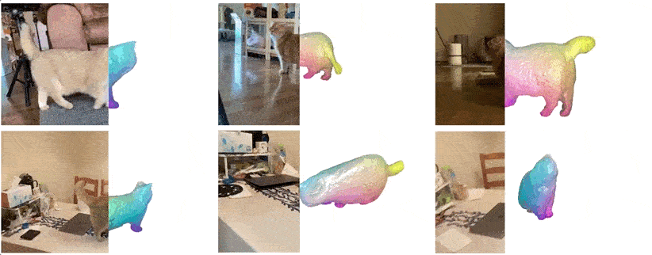
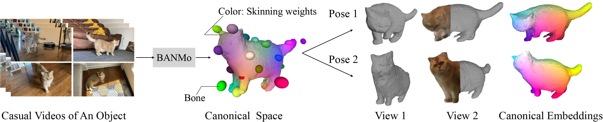
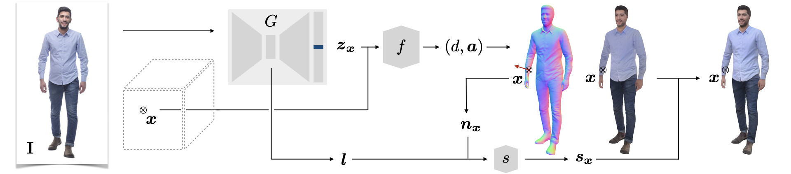
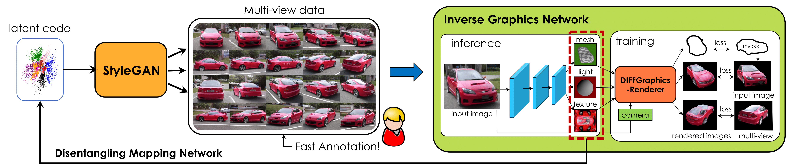

# 
Awesome-3D-CV-CG

Awesome 3D Computer Vision and Computer Graphics.

  

## 3D Object Reconstruction from Images and Videos

BANMo: Building Animatable 3D Neural Models from Many Casual Videos

    

Prior work for articulated 3D shape reconstruction often relies on specialized sensors (e.g., synchronized multicamera systems), or pre-built 3D deformable models (e.g., SMAL or SMPL). Such methods are not able to scale to diverse sets of objects in the wild. We present BANMo, a method that requires neither a specialized sensor nor a pre-defined template shape. BANMo builds high-fidelity, articulated 3D “models” (including shape and animatable skinning weights) from many monocular casual videos in a differentiable rendering framework. While the use of many videos provides more coverage of camera views and object articulations, they introduce significant challenges in establishing correspondence across scenes with different backgrounds, illumination conditions, etc. Our key insight is to merge three schools of thought; (1) classic deformable shape models that make use of articulated bones and blend skinning, (2) volumetric neural radiance fields (NeRFs) that are amenable to gradient-based optimization, and (3) canonical embeddings that generate correspondences between pixels and an articulated model. We introduce neural blend skinning models that allow for differentiable and invertible articulated deformations. When combined with canonical embeddings, such models allow us to establish dense correspondences across videos that can be self-supervised with cycle consistency. On real and synthetic datasets, BANMo shows higher-fidelity 3D reconstructions than prior works for humans and animals, with the ability to render realistic images from novel viewpoints and poses. 
  
code: https://github.com/facebookresearch/banmo  
paper: https://arxiv.org/pdf/2112.12761.pdf   
project: https://banmo-www.github.io/

PHORHUM: Photorealistic Monocular 3D Reconstruction of Humans Wearing Clothing

    

We present PHORHUM, a novel, end-to-end trainable, deep neural network methodology for photorealistic 3D human reconstruction given just a monocular RGB image. Our pixel-aligned method estimates detailed 3D geometry and, for the first time, the unshaded surface color together with the scene illumination. Observing that 3D supervision alone is not sufficient for high fidelity color reconstruction, we introduce patch-based rendering losses that enable reliable color reconstruction on visible parts of the human, and detailed and plausible color estimation for the non-visible parts. Moreover, our method specifically addresses methodological and practical limitations of prior work in terms of representing geometry, albedo, and illumination effects, in
an end-to-end model where factors can be effectively disentangled. In extensive experiments, we demonstrate the versatility and robustness of our approach. Our state-ofthe-art results validate the method qualitatively and for different metrics, for both geometric and color reconstruction. 

code:  
paper: https://arxiv.org/pdf/2204.08906.pdf  
project: https://phorhum.github.io/  

GANverse3D: Image GANs meet Differentiable Rendering for Inverse Graphics and Interpretable 3D Neural Rendering

  

Differentiable rendering has paved the way to training neural networks to perform “inverse graphics” tasks such as predicting 3D geometry from monocular photographs. To train high performing models, most of the current approaches rely on multi-view imagery which are not readily available in practice. Recent Generative Adversarial Networks (GANs) that synthesize images, in contrast, seem to acquire 3D knowledge implicitly during training: object viewpoints can be manipulated by simply manipulating the latent codes. However, these latent codes often lack further physical interpretation and thus GANs cannot easily be inverted to perform explicit 3D reasoning. In this paper, we aim to extract and disentangle 3D knowledge learned by generative models by utilizing differentiable renderers. Key to our approach is to exploit GANs as a multi-view data generator to train an inverse graphics network using an off-the-shelf differentiable renderer, and the trained inverse graphics network as a teacher to disentangle the GAN’s latent code into interpretable 3D properties. The entire architecture is trained iteratively using cycle consistency losses. We show that our approach significantly outperforms state-of-the-art inverse graphics networks trained on existing datasets,both quantitatively and via user studies. We further showcase the disentangled GAN as a controllable 3D “neural renderer”, complementing traditional graphics renderers.  

code:  
paper: https://arxiv.org/pdf/2010.09125.pdf  
project: https://nv-tlabs.github.io/GANverse3D/ 

PIFuHD: Multi-Level Pixel-Aligned Implicit Function for High-Resolution 3D Human Digitization

Recent advances in image-based 3D human shape estimation have been driven by the significant improvement in representation power afforded by deep neural networks. Although current approaches have demonstrated the potential in real world settings, they still fail to produce reconstructions with the level of detail often present in the input images. We argue that this limitation stems primarily form two conflicting requirements; accurate predictions require large context, but precise predictions require high resolution. Due to memory limitations in current hardware, previous approaches tend to take low resolution images as input to cover large spatial context, and produce less precise (or low resolution) 3D estimates as a result. We address this limitation by formulating a multi-level architecture that is end-to-end trainable. A coarse level observes the whole image at lower resolution and focuses on holistic reasoning. This provides context to an fine level which estimates highly detailed geometry by observing higher-resolution images. We demonstrate that our approach significantly outperforms existing state-of-the-art techniques on single image human shape reconstruction by fully leveraging 1k-resolution input images.  

code: https://github.com/facebookresearch/pifuhd  
paper: https://arxiv.org/pdf/2004.00452.pdf   
project: https://shunsukesaito.github.io/PIFuHD/

---

## Neural Radiance Fields (NeRF)
