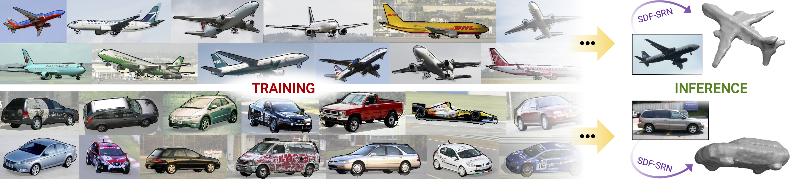

# 
Awesome-3D-CV-CG

Awesome 3D Computer Vision and Computer Graphics.

  

## 3D Object Reconstruction from Images and Videos

BANMo: Building Animatable 3D Neural Models from Many Casual Videos

    

Prior work for articulated 3D shape reconstruction often relies on specialized sensors (e.g., synchronized multicamera systems), or pre-built 3D deformable models (e.g., SMAL or SMPL). Such methods are not able to scale to diverse sets of objects in the wild. We present BANMo, a method that requires neither a specialized sensor nor a pre-defined template shape. BANMo builds high-fidelity, articulated 3D “models” (including shape and animatable skinning weights) from many monocular casual videos in a differentiable rendering framework. While the use of many videos provides more coverage of camera views and object articulations, they introduce significant challenges in establishing correspondence across scenes with different backgrounds, illumination conditions, etc. Our key insight is to merge three schools of thought; (1) classic deformable shape models that make use of articulated bones and blend skinning, (2) volumetric neural radiance fields (NeRFs) that are amenable to gradient-based optimization, and (3) canonical embeddings that generate correspondences between pixels and an articulated model. We introduce neural blend skinning models that allow for differentiable and invertible articulated deformations. When combined with canonical embeddings, such models allow us to establish dense correspondences across videos that can be self-supervised with cycle consistency. On real and synthetic datasets, BANMo shows higher-fidelity 3D reconstructions than prior works for humans and animals, with the ability to render realistic images from novel viewpoints and poses. 
  
code: https://github.com/facebookresearch/banmo  
paper: https://arxiv.org/pdf/2112.12761.pdf   
project: https://banmo-www.github.io/

PHORHUM: Photorealistic Monocular 3D Reconstruction of Humans Wearing Clothing

    

We present PHORHUM, a novel, end-to-end trainable, deep neural network methodology for photorealistic 3D human reconstruction given just a monocular RGB image. Our pixel-aligned method estimates detailed 3D geometry and, for the first time, the unshaded surface color together with the scene illumination. Observing that 3D supervision alone is not sufficient for high fidelity color reconstruction, we introduce patch-based rendering losses that enable reliable color reconstruction on visible parts of the human, and detailed and plausible color estimation for the non-visible parts. Moreover, our method specifically addresses methodological and practical limitations of prior work in terms of representing geometry, albedo, and illumination effects, in
an end-to-end model where factors can be effectively disentangled. In extensive experiments, we demonstrate the versatility and robustness of our approach. Our state-ofthe-art results validate the method qualitatively and for different metrics, for both geometric and color reconstruction. 

code:  
paper: https://arxiv.org/pdf/2204.08906.pdf  
project: https://phorhum.github.io/  

GANverse3D: Image GANs meet Differentiable Rendering for Inverse Graphics and Interpretable 3D Neural Rendering

  

Differentiable rendering has paved the way to training neural networks to perform “inverse graphics” tasks such as predicting 3D geometry from monocular photographs. To train high performing models, most of the current approaches rely on multi-view imagery which are not readily available in practice. Recent Generative Adversarial Networks (GANs) that synthesize images, in contrast, seem to acquire 3D knowledge implicitly during training: object viewpoints can be manipulated by simply manipulating the latent codes. However, these latent codes often lack further physical interpretation and thus GANs cannot easily be inverted to perform explicit 3D reasoning. In this paper, we aim to extract and disentangle 3D knowledge learned by generative models by utilizing differentiable renderers. Key to our approach is to exploit GANs as a multi-view data generator to train an inverse graphics network using an off-the-shelf differentiable renderer, and the trained inverse graphics network as a teacher to disentangle the GAN’s latent code into interpretable 3D properties. The entire architecture is trained iteratively using cycle consistency losses. We show that our approach significantly outperforms state-of-the-art inverse graphics networks trained on existing datasets,both quantitatively and via user studies. We further showcase the disentangled GAN as a controllable 3D “neural renderer”, complementing traditional graphics renderers.  

code:  
paper: https://arxiv.org/pdf/2010.09125.pdf  
project: https://nv-tlabs.github.io/GANverse3D/ 

ARCH++: Animation-Ready Clothed Human Reconstruction Revisited

We present ARCH++, an image-based method to reconstruct 3D avatars with arbitrary clothing styles. Our reconstructed avatars are animation-ready and highly realistic, in both the visible regions from input views and the unseen regions. While prior work shows great promise of reconstructing animatable clothed humans with various topologies, we observe that there exist fundamental limitations resulting in sub-optimal reconstruction quality. In this paper, we revisit the major steps of image-based avatar reconstruction and address the limitations with ARCH++. First, we introduce an end-to-end point based geometry encoder to better describe the semantics of the underlying 3D human body, in replacement of previous hand-crafted features. Second, in order to address the occupancy ambiguity caused by topological changes of clothed humans in the canonical pose, we propose a co-supervising framework with cross-space consistency to jointly estimate the occupancy in both the posed and canonical spaces. Last, we use image-to-image translation networks to further refine detailed geometry and texture on the reconstructed surface, which improves the fidelity and consistency across arbitrary viewpoints. In the experiments, we demonstrate improvements over the state of the art on both public benchmarks and user studies in reconstruction quality and realism.  

code:   
paper: https://arxiv.org/pdf/2108.07845.pdf   
project: https://tonghehehe.com/archpp

ARCH: Animatable Reconstruction of Clothed Humans

In this paper, we propose ARCH (Animatable Reconstruction of Clothed Humans), a novel end-to-end framework for accurate reconstruction of animation-ready 3D clothed humans from a monocular image. Existing approaches to digitize 3D humans struggle to handle pose variations and recover details. Also, they do not produce models that are animation ready. In contrast, ARCH is a learned pose-aware model that produces detailed 3D rigged full-body human avatars from a single unconstrained RGB image. A Semantic Space and a Semantic Deformation Field are created using a parametric 3D body estimator. They allow the transformation of 2D/3D clothed humans into a canonical space, reducing ambiguities in geometry caused by pose variations and occlusions in training data. Detailed surface geometry and appearance are learned using an implicit function representation with spatial local features. Furthermore, we propose additional per-pixel supervision on the 3D reconstruction using opacity-aware differentiable rendering. Our experiments indicate that ARCH increases the fidelity of the reconstructed humans. We obtain more than 50% lower reconstruction errors for standard metrics compared to state-of-the-art methods on public datasets. We also show numerous qualitative examples of animated, high-quality reconstructed avatars unseen in the literature so far.   

code:   
paper: https://arxiv.org/pdf/2004.04572.pdf  
project: https://vgl.ict.usc.edu/Research/ARCH/  

PIFuHD: Multi-Level Pixel-Aligned Implicit Function for High-Resolution 3D Human Digitization

Recent advances in image-based 3D human shape estimation have been driven by the significant improvement in representation power afforded by deep neural networks. Although current approaches have demonstrated the potential in real world settings, they still fail to produce reconstructions with the level of detail often present in the input images. We argue that this limitation stems primarily form two conflicting requirements; accurate predictions require large context, but precise predictions require high resolution. Due to memory limitations in current hardware, previous approaches tend to take low resolution images as input to cover large spatial context, and produce less precise (or low resolution) 3D estimates as a result. We address this limitation by formulating a multi-level architecture that is end-to-end trainable. A coarse level observes the whole image at lower resolution and focuses on holistic reasoning. This provides context to an fine level which estimates highly detailed geometry by observing higher-resolution images. We demonstrate that our approach significantly outperforms existing state-of-the-art techniques on single image human shape reconstruction by fully leveraging 1k-resolution input images.  

code: https://github.com/facebookresearch/pifuhd  
paper: https://arxiv.org/pdf/2004.00452.pdf   
project: https://shunsukesaito.github.io/PIFuHD/

Geo-PIFu: Geometry and Pixel Aligned Implicit Functions for Single-view Human Reconstruction

We propose Geo-PIFu, a method to recover a 3D mesh from a monocular color image of a clothed person. Our method is based on a deep implicit function-based representation to learn latent voxel features using a structure-aware 3D U-Net, to constrain the model in two ways: first, to resolve feature ambiguities in query point encoding, second, to serve as a coarse human shape proxy to regularize the high-resolution mesh and encourage global shape regularity. We show that, by both encoding query points and constraining global shape using latent voxel features, the reconstruction we obtain for clothed human meshes exhibits less shape distortion and improved surface details compared to competing methods. We evaluate Geo-PIFu on a recent human mesh public dataset that is 10× larger than the private commercial dataset used in PIFu and previous derivative work. On average, we exceed the state of the art by 42.7% reduction in Chamfer and Point-to-Surface Distances, and 19.4% reduction in normal estimation errors.  

code: https://github.com/simpleig/Geo-PIFu  
paper: https://arxiv.org/pdf/1905.05172.pdf   
project: 

PIFu: Pixel-Aligned Implicit Function for High-Resolution Clothed Human Digitization

We introduce Pixel-aligned Implicit Function (PIFu), a highly effective implicit representation that locally aligns pixels of 2D images with the global context of their corresponding 3D object. Using PIFu, we propose an end-to-end deep learning method for digitizing highly detailed clothed humans that can infer both 3D surface and texture from a single image, and optionally, multiple input images. Highly intricate shapes, such as hairstyles, clothing, as well as their variations and deformations can be digitized in a unified way. Compared to existing representations used for 3D deep learning, PIFu can produce high-resolution surfaces including largely unseen regions such as the back of a person. In particular, it is memory efficient unlike the voxel representation, can handle arbitrary topology, and the resulting surface is spatially aligned with the input image. Furthermore, while previous techniques are designed to process either a single image or multiple views, PIFu extends naturally to arbitrary number of views. We demonstrate high-resolution and robust reconstructions on real world images from the DeepFashion dataset, which contains a variety of challenging clothing types. Our method achieves state-of-the-art performance on a public benchmark and outperforms the prior work for clothed human digitization from a single image.  

code: https://github.com/shunsukesaito/PIFu  
paper: https://arxiv.org/pdf/1905.05172.pdf   
project: https://shunsukesaito.github.io/PIFu/

SDF-SRN: Learning Signed Distance 3D Object Reconstruction from Static Images [NeurIPS 2020]

Dense 3D object reconstruction from a single image has recently witnessed remarkable advances, but supervising neural networks with ground-truth 3D shapes is impractical due to the laborious process of creating paired image-shape datasets. Recent efforts have turned to learning 3D reconstruction without 3D supervision from RGB images with annotated 2D silhouettes, dramatically reducing the cost and effort of annotation. These techniques, however, remain impractical as they still require multi-view annotations of the same object instance during training. As a result, most experimental efforts to date have been limited to synthetic datasets. In this paper, we address this issue and propose SDF-SRN, an approach that requires only a single view of objects at training time, offering greater utility for real-world scenarios. SDF-SRN learns implicit 3D shape representations to handle arbitrary shape topologies that may exist in the datasets. To this end, we derive a novel differentiable rendering formulation for learning signed distance functions (SDF) from 2D silhouettes. Our method outperforms the state of the art under challenging single-view supervision settings on both synthetic and real-world datasets.   

code: https://github.com/chenhsuanlin/signed-distance-SRN  
paper: https://arxiv.org/pdf/2010.10505.pdf  
project: https://chenhsuanlin.bitbucket.io/signed-distance-SRN/  

Pix2Vox++: Multi-scale Context-aware 3D Object Reconstruction from Single and Multiple Images [IJCV 2020]

Recovering the 3D shape of an object from single or multiple images with deep neural networks has been attracting increasing attention in the past few years. Mainstream works (e.g. 3D-R2N2) use recurrent neural networks (RNNs) to sequentially fuse feature maps of input images. However, RNN-based approaches are unable to produce consistent reconstruction results when given the same input images with different orders. Moreover, RNNs may forget important features from early input images due to long-term memory loss. To address these issues, we propose a novel framework for single-view and multi-view 3D object reconstruction, named Pix2Vox++. By using a well-designed encoderdecoder, it generates a coarse 3D volume from each input image. A multi-scale context-aware fusion module is then introduced to adaptively select high-quality reconstructions for different parts from all coarse 3D volumes to obtain a fused 3D volume. To further correct the wrongly recovered parts in the fused 3D volume, a refiner is adopted to generate the final output. Experimental results on the ShapeNet, Pix3D, and Things3D benchmarks show that Pix2Vox++ performs favorably against state-of-the-art methods in terms of both accuracy and efficiency.   

code: https://github.com/hzxie/Pix2Vox  
paper: https://arxiv.org/pdf/2006.12250.pdf  
project:   

Multi-Garment Net: Learning to Dress 3D People from Images [ICCV 2019]

We present Multi-Garment Network (MGN), a method to predict body shape and clothing, layered on top of the SMPL model from a few frames (1-8) of a video. Several experiments demonstrate that this representation allows higher level of control when compared to single mesh or voxel representations of shape. Our model allows to predict garment geometry, relate it to the body shape, and transfer it to new body shapes and poses. To train MGN, we leverage a digital wardrobe containing 712 digital garments in correspondence, obtained with a novel method to register a set of clothing templates to a dataset of real 3D scans of people in different clothing and poses. Garments from the digital wardrobe, or predicted by MGN, can be used to dress any body shape in arbitrary poses.   

code: https://github.com/bharat-b7/MultiGarmentNetwork  
paper: https://arxiv.org/pdf/1908.06903.pdf  
project: https://virtualhumans.mpi-inf.mpg.de/mgn/  

Pix2Vox: Context-aware 3D Reconstruction from Single and Multi-view Images [ICCV 2019]

Recovering the 3D representation of an object from single-view or multi-view RGB images by deep neural networks has attracted increasing attention in the past few years. Several mainstream works (e.g., 3D-R2N2) use recurrent neural networks (RNNs) to fuse multiple feature maps extracted from input images sequentially. However, when given the same set of input images with different orders, RNN-based approaches are unable to produce consistent reconstruction results. Moreover, due to long-term memory loss, RNNs cannot fully exploit input images to refine reconstruction results. To solve these problems, we propose a novel framework for single-view and multi-view 3D reconstruction, named Pix2Vox. By using a well-designed encoder-decoder, it generates a coarse 3D volume from each input image. Then, a context-aware fusion module is introduced to adaptively select high-quality reconstructions for each part (e.g., table legs) from different coarse 3D volumes to obtain a fused 3D volume. Finally, a refiner further refines the fused 3D volume to generate the final output. Experimental results on the ShapeNet and Pix3D benchmarks indicate that the proposed Pix2Vox outperforms state-ofthe-arts by a large margin. Furthermore, the proposed method is 24 times faster than 3D-R2N2 in terms of backward inference time. The experiments on ShapeNet unseen
3D categories have shown the superior generalization abilities of our method.   

code: https://github.com/hzxie/Pix2Vox  
paper: https://arxiv.org/pdf/1901.11153.pdf  
project: https://infinitescript.com/project/pix2vox/  

DIB-R: Learning to Predict 3D Objects with an Interpolation-based Differentiable Renderer [NeurIPS 2019]

Many machine learning models operate on images, but ignore the fact that images are 2D projections formed by 3D geometry interacting with light, in a process called rendering. Enabling ML models to understand image formation might be key for generalization. However, due to an essential rasterization step involving discrete assignment operations, rendering pipelines are non-differentiable and thus largely inaccessible to gradient-based ML techniques. In this paper, we present DIB-R, a differentiable rendering framework which allows gradients to be analytically computed for all pixels in an image. Key to our approach is to view foreground rasterization as a weighted interpolation of local properties and background rasterization as an distance-based aggregation of global geometry. Our approach allows for accurate optimization over vertex positions, colors, normals, light directions and texture coordinates through a variety of lighting models. We showcase our approach in two ML applications: single-image 3D object prediction, and 3D textured object generation, both trained using exclusively using 2D supervision.   

code: https://github.com/nv-tlabs/DIB-R-Single-Image-3D-Reconstruction  
paper: https://arxiv.org/pdf/1908.01210.pdf   
project: https://nv-tlabs.github.io/DIB-R/

DenseBody: Directly Regressing Dense 3D Human Pose and Shape From a Single Color Image [arXiv 2019]

Recovering 3D human body shape and pose from 2D images is a challenging task due to high complexity and flexibility of human body, and relatively less 3D labeled data. Previous methods addressing these issues typically rely on predicting intermediate results such as body part segmentation, 2D/3D joints, silhouette mask to decompose the problem into multiple sub-tasks in order to utilize more 2D labels. Most previous works incorporated parametric body shape model in their methods and predict parameters in low-dimensional space to represent human body. In this paper, we propose to directly regress the 3D human mesh from a single color image using Convolutional Neural Network(CNN). We use an efficient representation of 3D human shape and pose which can be predicted through an encoder-decoder neural network. The proposed method achieves state-of-the-art performance on several 3D human body datasets including Human3.6M, SURREAL and UP3D with even faster running speed.   

code: https://github.com/Lotayou/densebody_pytorch  
paper: https://arxiv.org/pdf/1903.10153.pdf   
project: 

nvdiffrec: Extracting Triangular 3D Models, Materials, and Lighting From Images

We present an efficient method for joint optimization of topology, materials and lighting from multi-view image observations. Unlike recent multi-view reconstruction approaches, which typically produce entangled 3D representations encoded in neural networks, we output triangle meshes with spatially-varying materials and environment lighting that can be deployed in any traditional graphics engine unmodified. We leverage recent work in differentiable rendering, coordinate-based networks to compactly represent volumetric texturing, alongside differentiable marching tetrahedrons to enable gradient-based optimization directly on the surface mesh. Finally, we introduce a differentiable formulation of the split sum approximation of environment lighting to efficiently recover all-frequency lighting. Experiments show our extracted models used in advanced scene editing, material decomposition, and high quality view interpolation, all running at interactive rates in triangle-based renderers (rasterizers and path tracers).   

code: https://github.com/NVlabs/nvdiffrec  
paper: https://arxiv.org/pdf/2111.12503.pdf   
project: https://nvlabs.github.io/nvdiffrec/

Pixel2Mesh: Generating 3D Mesh Models from Single RGB Images [ECCV 2018]

We propose an end-to-end deep learning architecture that produces a 3D shape in triangular mesh from a single color image. Limited by the nature of deep neural network, previous methods usually represent a 3D shape in volume or point cloud, and it is non-trivial to convert them to the more ready-to-use mesh model. Unlike the existing methods, our network represents 3D mesh in a graph-based convolutional neural network and produces correct geometry by progressively deforming an ellipsoid, leveraging perceptual features extracted from the input image. We adopt a coarse-to-fine strategy to make the whole deformation procedure stable, and define various of mesh related losses to capture properties of different levels to guarantee visually appealing and physically accurate 3D geometry. Extensive experiments show that our method not only qualitatively produces mesh model with better details, but also achieves higher 3D shape estimation accuracy compared to the state-of-the-art.   

code: https://github.com/nywang16/Pixel2Mesh  
code: https://github.com/noahcao/Pixel2Mesh  
code: https://github.com/Tong-ZHAO/Pixel2Mesh-Pytorch  
paper: https://arxiv.org/pdf/1804.01654.pdf   
project: https://nywang16.github.io/p2m/index.html

Neural 3D Mesh Renderer [CVPR 2018]

For modeling the 3D world behind 2D images, which 3D representation is most appropriate? A polygon mesh is a promising candidate for its compactness and geometric properties. However, it is not straightforward to model a polygon mesh from 2D images using neural networks because the conversion from a mesh to an image, or rendering, involves a discrete operation called rasterization, which prevents back-propagation. Therefore, in this work, we propose an approximate gradient for rasterization that enables the integration of rendering into neural networks. Using this renderer, we perform single-image 3D mesh reconstruction with silhouette image supervision and our system outperforms the existing voxel-based approach. Additionally, we perform gradient-based 3D mesh editing operations, such as 2D-to-3D style transfer and 3D DeepDream, with 2D supervision for the first time. These applications demonstrate the potential of the integration of a mesh renderer into neural networks and the effectiveness of our proposed renderer.   

code: https://github.com/hiroharu-kato/neural_renderer  
paper: https://arxiv.org/pdf/1711.07566.pdf   
project: https://hiroharu-kato.com/publication/neural_renderer/

Pix3D: Dataset and Methods for Single-Image 3D Shape Modeling [CVPR 2018]

We study 3D shape modeling from a single image and make contributions to it in three aspects. First, we present Pix3D, a large-scale benchmark of diverse image-shape pairs with pixel-level 2D-3D alignment. Pix3D has wide applications in shape-related tasks including reconstruction, retrieval, viewpoint estimation, etc. Building such a large-scale dataset, however, is highly challenging; existing datasets either contain only synthetic data, or lack precise alignment between 2D images and 3D shapes, or only have a small number of images. Second, we calibrate the evaluation criteria for 3D shape reconstruction through behavioral studies, and use them to objectively and systematically benchmark cuttingedge reconstruction algorithms on Pix3D. Third, we design a novel model that simultaneously performs 3D reconstruction and pose estimation; our multi-task learning approach achieves state-of-the-art performance on both tasks.   

code: https://github.com/xingyuansun/pix3d  
paper: https://arxiv.org/pdf/1804.04610.pdf   
project: http://pix3d.csail.mit.edu/

Learning Efficient Point Cloud Generation for Dense 3D Object Reconstruction [AAAI 2018]

Conventional methods of 3D object generative modeling learn volumetric predictions using deep networks with 3D convolutional operations, which are direct analogies to classical 2D ones. However, these methods are computationally wasteful in attempt to predict 3D shapes, where information is rich only on the surfaces. In this paper, we propose a novel 3D generative modeling framework to efficiently generate object shapes in the form of dense point clouds. We use 2D convolutional operations to predict the 3D structure from multiple viewpoints and jointly apply geometric reasoning with 2D projection optimization. We introduce the pseudo-renderer, a differentiable module to approximate the true rendering operation, to synthesize novel depth maps for optimization. Experimental results for single-image 3D object reconstruction tasks show that we outperforms state-of-the-art methods in terms of shape similarity and prediction density.   

code: https://github.com/chenhsuanlin/3D-point-cloud-generation  
code: https://github.com/lkhphuc/pytorch-3d-point-cloud-generation  
paper: https://arxiv.org/pdf/1706.07036.pdf   
project: https://chenhsuanlin.bitbucket.io/3D-point-cloud-generation/  

Im2Avatar: Colorful 3D Reconstruction from a Single Image [arXiv 2018]

Existing works on single-image 3D reconstruction mainly focus on shape recovery. In this work, we study a new problem, that is, simultaneously recovering 3D shape and surface color from a single image, namely colorful 3D reconstruction. This problem is both challenging and intriguing because the ability to infer textured 3D model from a single image is at the core of visual understanding. Here, we propose an end-to-end trainable framework, Colorful Voxel Network (CVN), to tackle this problem. Conditioned on a single 2D input, CVN learns to decompose shape and surface color information of a 3D object into a 3D shape branch and a surface color branch, respectively. Specifically, for the shape recovery, we generate a shape volume with the state of its voxels indicating occupancy. For the surface color recovery, we combine the strength of appearance hallucination and geometric projection by concurrently learning a regressed color volume and a 2D-to-3D flow volume, which are then fused into a blended color volume. The final textured 3D model is obtained by sampling color from the blended color volume at the positions of occupied voxels in the shape volume. To handle the severe sparse volume representations, a novel loss function, Mean Squared False Cross-Entropy Loss (MSFCEL), is designed. Extensive experiments demonstrate that our approach achieves significant improvement over baselines, and shows great generalization across diverse object categories and arbitrary viewpoints.   

code: https://github.com/syb7573330/im2avatar  
paper: https://arxiv.org/pdf/1804.06375.pdf   
project: https://liuziwei7.github.io/projects/Im2Avatar

A Point Set Generation Network for 3D Object Reconstruction from a Single Image [CVPR 2017]

Generation of 3D data by deep neural network has been attracting increasing attention in the research community. The majority of extant works resort to regular representations such as volumetric grids or collection of images; however, these representations obscure the natural invariance of 3D shapes under geometric transformations, and also suffer from a number of other issues. In this paper we address the problem of 3D reconstruction from a single
image, generating a straight-forward form of output – point cloud coordinates. Along with this problem arises a unique and interesting issue, that the groundtruth shape for an input image may be ambiguous. Driven by this unorthodox output form and the inherent ambiguity in groundtruth, we design architecture, loss function and learning paradigm that are novel and effective. Our final solution is a conditional shape sampler, capable of predicting multiple plausible 3D point clouds from an input image. In experiments not only can our system outperform state-ofthe-art methods on single image based 3d reconstruction benchmarks; but it also shows strong performance for 3d shape completion and promising ability in making multiple plausible predictions.   

code: https://github.com/fanhqme/PointSetGeneration  
paper: https://arxiv.org/pdf/1612.00603.pdf  
project: 

3D-R2N2: 3D Recurrent Reconstruction Neural Network [ECCV 2016]

Inspired by the recent success of methods that employ shape priors to achieve robust 3D reconstructions, we propose a novel recurrent neural network architecture that we call the 3D Recurrent Reconstruction Neural Network (3D-R2N2). The network learns a mapping from images of objects to their underlying 3D shapes from a large collection of synthetic data using 3D-Convolutional LSTM which allows attention mechanism to focus on visible parts in 3D. Our network takes in one or more images of an object instance from arbitrary viewpoints and outputs a reconstruction of the object in the form of a 3D occupancy grid. Unlike most of the previous works, our network does not require any image annotations or object class labels for training or testing. Our extensive experimental analysis shows that our reconstruction framework i) outperforms the state-of-theart methods for single view reconstruction, and ii) enables the 3D reconstruction of objects in situations when traditional SFM/SLAM methods fail (because of lack of texture and/or wide baseline).   

code: https://github.com/chrischoy/3D-R2N2  
paper: https://arxiv.org/pdf/1604.00449.pdf  
project: https://cvgl.stanford.edu/3d-r2n2/

---

## Neural Radiance Fields (NeRF)

---

## Generative Adversarial Network (GAN)
